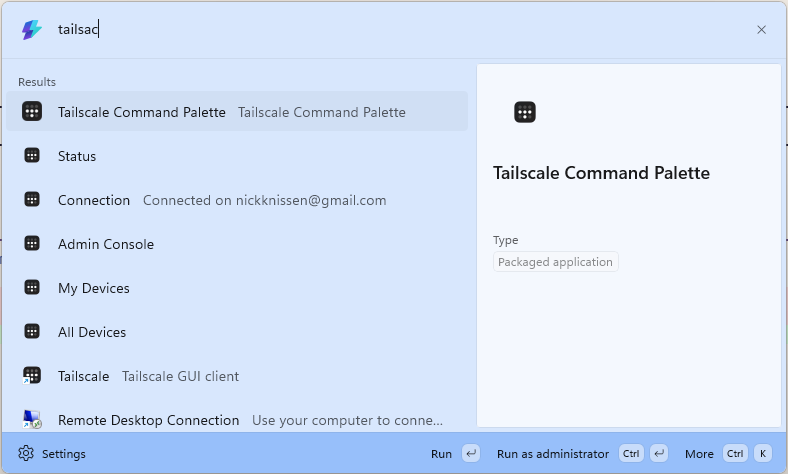

# Tailscale Command Palette

A PowerToys Command Palette extension that brings common Tailscale actions and device information into the Command Palette UI.

## Screenshot



## Features

- Browse **all devices** in your tailnet
- Browse **only your devices**
- View **connection status** and local Tailscale details
- Quickly **connect** or **disconnect** Tailscale
- Open the **Tailscale Admin Console**
- Copy useful device data:
  - Tailscale IPv4
  - Tailscale IPv6
  - MagicDNS name
- See device metadata at a glance:
  - online/offline state
  - operating system
  - current device
  - exit node
  - SSH availability

## How it works

This extension shells out to the local `tailscale` CLI and parses `tailscale status --json` to populate Command Palette pages and actions.

## Requirements

- **Windows 10 2004+** or **Windows 11**
- **.NET 9 SDK** for local development
- **Tailscale** installed and signed in
- The `tailscale` command available on your `PATH`
- Microsoft PowerToys with **Command Palette** support

## Installation

### Option 1: WinGet

Install from WinGet:

```powershell
winget install nickknissen.TailscaleCommandPalette
```

### Option 2: Manual install

1. Download the latest installer for your architecture from the project releases.
2. Run the installer.
3. Restart Command Palette if it is already running.

## Usage

After installation, open **PowerToys Command Palette** and look for the **Tailscale** provider.

Top-level commands include:

- **All Devices**
- **My Devices**
- **Status**
- **Connection**
- **Admin Console**

### Device actions

Selecting a device copies its primary Tailscale IP by default.

Additional context actions may include:

- **Copy IPv6**
- **Copy MagicDNS**
- **Open in browser**

## Screens / Commands

### All Devices

Shows the full visible tailnet inventory, grouped by:

- **This Device**
- **Online**
- **Offline**

### My Devices

Filters the device list to the currently signed-in Tailscale user.

### Status

Shows:

- connection state
- hostname
- local Tailscale IPs
- tailnet name
- active exit node
- visible device count
- extension version and commit metadata

### Connection

Changes automatically based on the current state:

- **Up** when disconnected
- **Down** when connected

## Development

### Build from source

```powershell
dotnet restore
dotnet build TailscaleCommandPalette.sln
```

### Publish a self-contained build

Example for x64:

```powershell
dotnet publish .\TailscaleCommandPalette\TailscaleCommandPalette.csproj `
  --configuration Release `
  --runtime win-x64 `
  --self-contained true `
  /p:WindowsPackageType=None
```

## Packaging

This repository includes an Inno Setup-based installer flow.

To build release installers:

```powershell
.\TailscaleCommandPalette\build-exe.ps1
```

Notes:

- Builds installers for **x64** and **arm64** by default
- Requires **Inno Setup 6** installed locally
- Produces installers under `TailscaleCommandPalette/bin/Release/installer`

## Project structure

```text
TailscaleCommandPalette/
├─ Commands/      # Command Palette invokable commands
├─ Models/        # Tailscale status/device models
├─ Pages/         # Command Palette list pages
├─ Services/      # Tailscale CLI integration and parsing
├─ Assets/        # App and extension icons
├─ build-exe.ps1  # Release installer build script
└─ setup-template.iss
```

## Troubleshooting

### The extension shows an error instead of devices

Common causes:

- Tailscale is not installed
- Tailscale is not running
- The device is not connected to a tailnet
- `tailscale.exe` is not on `PATH`

### Connection actions do not work

Make sure the Tailscale CLI works outside the extension first:

```powershell
tailscale status
tailscale up
tailscale down
```

### Device list is stale

The extension caches CLI results briefly to avoid excessive shelling out. Reopen the page or retry after a few seconds.

## Versioning

Current project version: **2.0.0**

Installer and WinGet continuity rely on preserving the existing app identity and installer GUID. See [`WINGET_REWRITE_CHECKLIST.md`](WINGET_REWRITE_CHECKLIST.md) for release notes related to packaging continuity.

## License

This project is licensed under the [MIT License](LICENSE).

## Disclaimer

This project is an independent extension for Microsoft PowerToys and is not affiliated with or endorsed by Tailscale or Microsoft.
